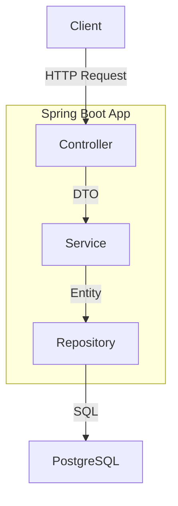

# ARCHITECTURE.md

## System Architecture

## Module тайлбар

| Layer | Package | Үүрэг |
|---|---|---|
| Controller | com.library.controller | HTTP endpoint, input validation |
| Service | com.library.service | Business logic |
| Repository | com.library.repository | DB query, JPA interface |
| Entity | com.library.entity | DB table mapping |
| DTO | com.library.dto | Request/Response object |

## Data Flow
1. Client → POST /api/books → BookController
2. BookController → BookService.createBook(dto)
3. BookService → BookRepository.save(entity)
4. PostgreSQL → entity буцаана → DTO болгоно → Client